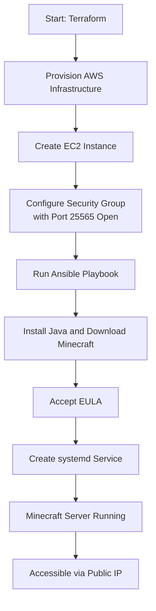

# Minecraft Server Deployment on AWS (Terraform + Ansible)

## Background

This project configures a Minecraft server on AWS using **Terraform** and **Ansible**. We use **Terraform** to create the infrastructure and **Ansible** to configure the instance and deploy the server.

The result is an automated server that can be accessed from anywhere using the public IP address.

---

## Requirements

### Required Tools

- Terraform
- Ansible
- AWS CLI configured (`aws configure`)

### Credentials

You must have:

- An AWS account
- A valid AWS key pair for automated SSH access

### Environment Setup

Set the following environment variables:

```bash
export AWS_ACCESS_KEY_ID=access_key
export AWS_SECRET_ACCESS_KEY=secret_key
export AWS_SESSION_TOKEN=session_token
export AWS_DEFAULT_REGION=us-east-1
```
## Major Steps Diagram


## Commands
### Clone the Repository
`git clone https://github.com/alexroz555/minecraft-infra.git`
`cd minecraft-infra`
### Provisioning Terraform
Go to the Terraform directory using `cd Terraform` and run these commands:
`terraform init`
`terraform apply`
### Running the Ansible script
Go to the Ansible directory using `cd Ansible` and run the script using this command:
`./run-script.sh`
## Connecting to the Server
Join the server by starting up Minecraft, going to Multiplayer, and joining a server by typing in the provided public IP in this format: <public_ip>:25565

